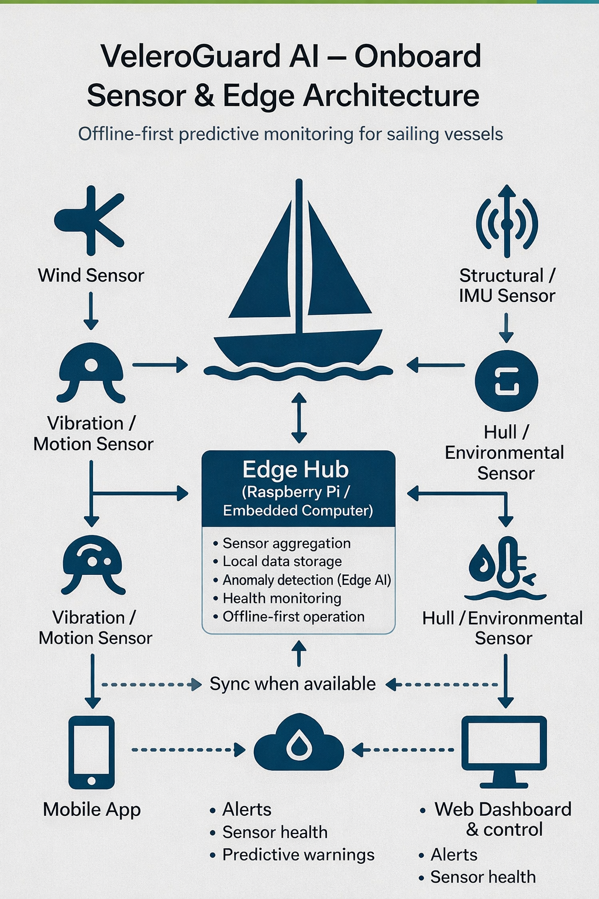
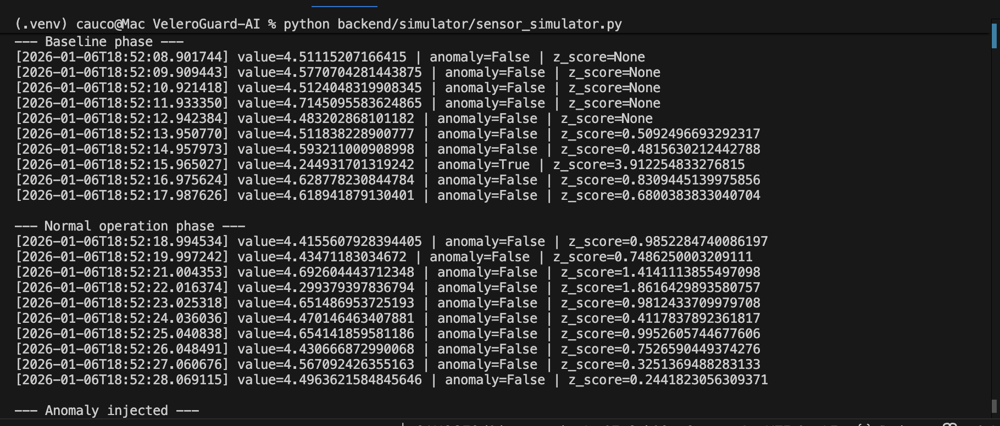
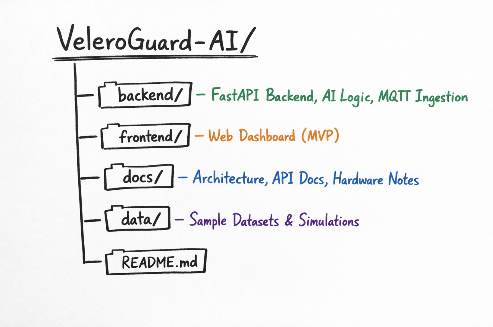

# VeleroGuard-AI
**Offline-first predictive monitoring system for sailing vessels using IoT sensors and Edge AI**

---

## 🚢 Overview

VeleroGuard AI is an open-source project focused on designing and implementing a **predictive monitoring system for sailing vessels**.  
It combines **IoT sensor data**, **edge-based machine learning**, and **real-time dashboards** to detect anomalies and anticipate potential structural, mechanical, and environmental failures during navigation.

The system is designed to operate reliably in **low-connectivity maritime environments**, prioritizing **offline-first operation**, low latency, and energy efficiency.

---

## 🎯 Project Goals

- Detect abnormal behavior in critical vessel components (mast, hull, rigging, mechanical systems)
- Provide early warnings and predictive alerts to support safer navigation
- Explore Edge AI patterns for safety-critical, resource-constrained environments
- Offer a clean, intuitive interface for non-technical users (captains and crew)

---

## 🧠 Key Features (MVP)

### Implemented / In Progress
- Real-time IoT data ingestion via MQTT
- Sensor data simulation (no physical hardware required)
- Backend API built with FastAPI
- Basic anomaly detection on time-series data
- Multi-level alert logic (informational, warning, warning, critical)
- Web-based dashboard for visualization

### Planned
- Predictive maintenance models (remaining useful life estimation)
- Offline data persistence and synchronization
- Mobile application (React Native)
- Integration with marine standards (NMEA 0183/2000)
- Support for real hardware sensors (Raspberry Pi + ESP32)

---

## 🏗️ System Architecture (High Level)


[Sensor Simulator / IoT Devices]
            ↓ (MQTT)
      [Ingestion Service]
            ↓
     [Preprocessing Layer]
            ↓
        [Edge AI Engine]
            ↓
       [Alert Manager]
            ↓
      [Web Dashboard]


---

## 🛥️ Physical & System Architecture (Onboard)

High-level overview of how sensors, edge computing, and user interfaces are deployed on a sailing vessel.




---

## 📸 Screenshots

### Backend running & API documentation
FastAPI backend running locally, receiving sensor data and exposing documented endpoints via Swagger UI.


---

### Sensor simulator output
The simulator generates a baseline, simulates normal operation, and injects a controlled anomaly detected in real time.



---

## 🛠️ Technologies Used

| Layer | Technology | Purpose |
|------|-----------|---------|
| Backend API | Python, FastAPI | Sensor ingestion, API layer, and data validation |
| Edge Intelligence | Python (statistics / ML-ready) | Real-time anomaly detection at the edge |
| Messaging | MQTT (planned) | Communication with onboard IoT sensors |
| Data Storage | In-memory (MVP), InfluxDB (planned) | Time-series sensor data storage |
| Frontend | Web Dashboard (planned) | Data visualization and alerts |
| Tooling | Docker, GitHub | Development, version control, and deployment |


---

## 🚀 Installation & Setup

### Backend Setup

Clone the repository and create a virtual environment:

```bash
git clone https://github.com/your-username/VeleroGuard-AI.git
cd VeleroGuard-AI
python -m venv .venv
source .venv/bin/activate
pip install -r backend/requirements.txt

```

### Start the backend server:

```bash
cd backend
uvicorn app.main:app --reload

```

### Once running, the API documentation will be available at:

```bash
http://127.0.0.1:8000/docs

```

---

## 📡 Usage Example
### Send a sensor reading to the backend using a simple HTTP request:

```bash
curl -X POST http://127.0.0.1:8000/sensors/ingest \
  -H "Content-Type: application/json" \
  -d '{
    "sensor_id": "mast_accelerometer_01",
    "sensor_type": "vibration",
    "value": 4.5
  }'

 ``` 

---

## 🛠️ Tech Stack

### Backend
- Python
- FastAPI
- MQTT (Mosquitto / public brokers for development)
- Scikit-learn (anomaly detection)
- InfluxDB (planned, time-series storage)
- Redis (planned, real-time alerts/cache)

### Frontend
- Web dashboard (React – planned structure)
- Real-time updates via WebSockets

### DevOps / Tooling
- Docker & Docker Compose
- GitHub for version control and collaboration

---

## 📁 Project Structure





## 🚧 Project Status

> **Early-stage MVP / Proof of Concept**

This project is under active development.  
Initial focus is on **architecture, data flow, and anomaly detection**, before expanding into predictive models and hardware integration.

---

## 🗺️ Roadmap

### Phase 1 — MVP
- Sensor simulation
- Real-time ingestion
- Basic anomaly detection
- Web dashboard

### Phase 2
- Predictive models
- Offline-first data synchronization
- Mobile app (React Native)
- Marine system integration (NMEA)

### Phase 3
- Advanced AI models
- Hardware sensor nodes
- Assisted navigation integrations
- Model marketplace per vessel type

---

## 🤝 Contributing

Contributions, feedback, and ideas are welcome.  
Feel free to open an issue or submit a pull request.

---

## 📄 License

MIT License

---

### 👤 Author

Developed as a personal project to demonstrate skills in **software architecture, IoT systems, edge AI, and full-stack development**.

If you’re interested in maritime technology, AI, or safety-critical systems, feel free to connect on LinkedIn.